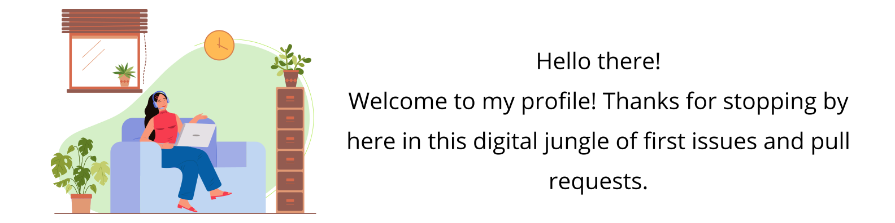

<!--
**Ishika13/ishika13** is a ✨ _special_ ✨ repository because its `README.md` (this file) appears on your GitHub profile.

--> 

### About Me: 
This is Ishika Kulkarni, a pre-final year student at Vellore Institute of Technology, Bhopal University. Currently I am pursuing BTech in Computer Science Engineering with specialisation in Artificial Intelligence and Machine Learning.
   
I am passionate about building projects that solve meaningful problems, being a big believer in helping others realize their full potential, especially when it boils down to female developers.  
 
*We are not here for a long time, but we are here to strike.* 

### Community Experiences:
<ul>
<li>Google Developers Student Club Lead at VIT Bhopal University </li>
<li>Former Content Writing and Digital Marketing Lead at GDSC VIT Bhopal </li>
<li>Former Club-Coordinator and Content Head at AI Club </li>
</ul>

### Techstack:

#### Development platforms
Android, Web, Flutter
#### Languages familiar with
C, C++, Java, Python, R, MySQL, Dart, Kotlin
#### Technologies interested in
Machine Learning, Artificial Intelligence, Computer Vision, Deep Learning, Data Analytics, Data Visualisation

### Non-Technical Skills
<ul>
 <li> Public Speaking </li>
 <li> Technical Writing</li>
 <li> Social Media Management and Management</li>
 <li> Community Building </li>
</ul>

When I'm not working on amazing new ideas, I find time to read, write or do yoga to free my mind and keep my body fit. But when I need a good boost of energy and creativity, nothing beats a cup of coffee.
 
### Stats:

 

### Connect with me:
<ul>
 <li> <a href="https://www.linkedin.com/in/ishikakulkarni/"> LinkedIn </a></li>  
<li><a href="https://twitter.com/KulkarniIshika"> Twitter </a></li>  
<li><a href="https://medium.com/@ishika-kulkarni"> Medium </a> </li>
<li><a href="ishikakulkarni2@gmail.com"> Email </a></li>
</ul>

